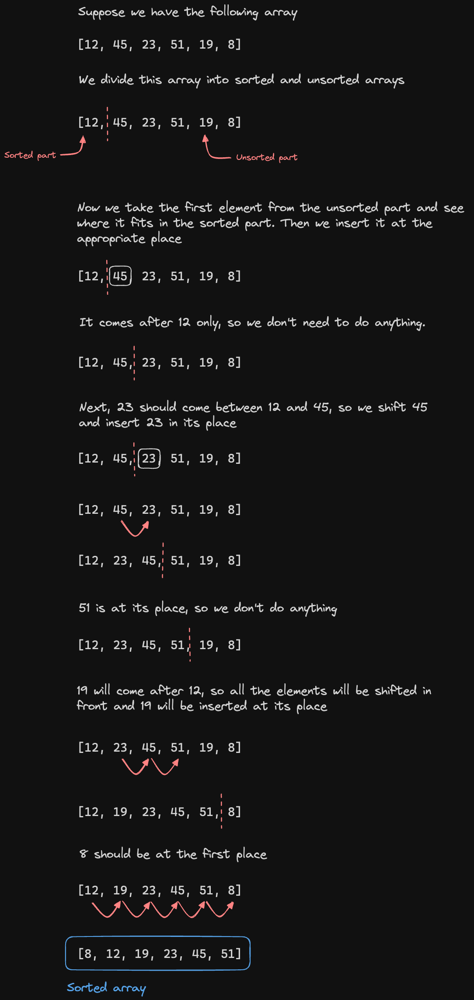

# Insertion sort

In insertion sort we divide the array into two parts, one sorted and one unsorted. Now we take an element from the sorted portion and insert it into the sorted position at the right place.

# Explanation



# Code

```java
public class InsertionSort {
    public static void main(String[] args) {
        int[] nums = {12, 45, 23, 51, 19, 8};

        for(int i=1; i<nums.length; i++) {
            int current = nums[i];

            int j = i-1;
            while(j>=0 && current < nums[j]) {
                nums[j+1] = nums[j];
                j--;
            }
            nums[j+1] = current;
        }

        for(int i : nums) {
            System.out.println(i);
        }
    }
}
```


